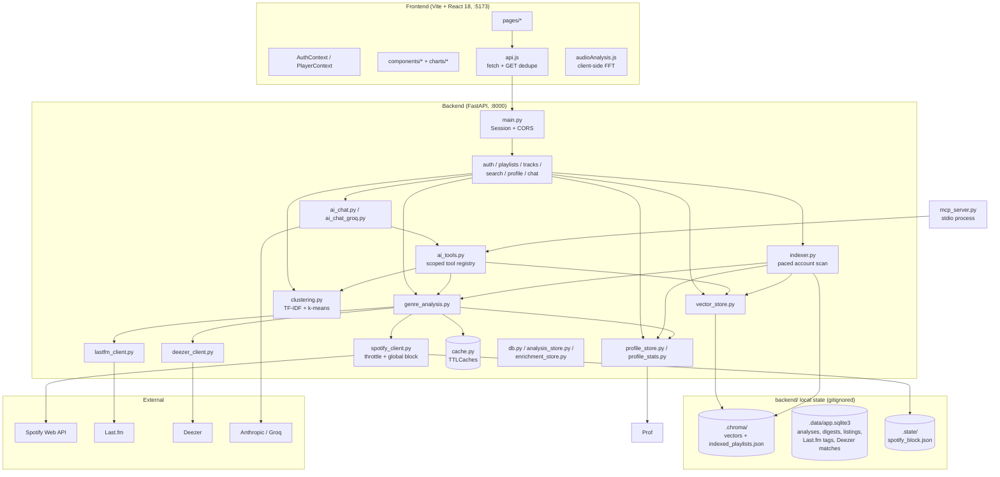
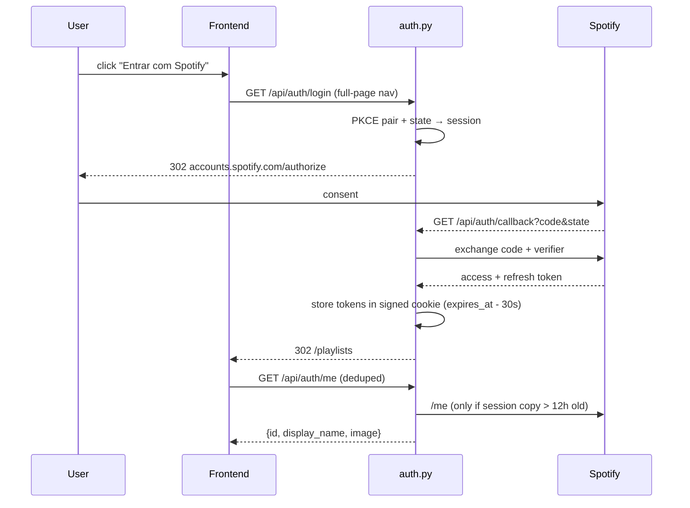
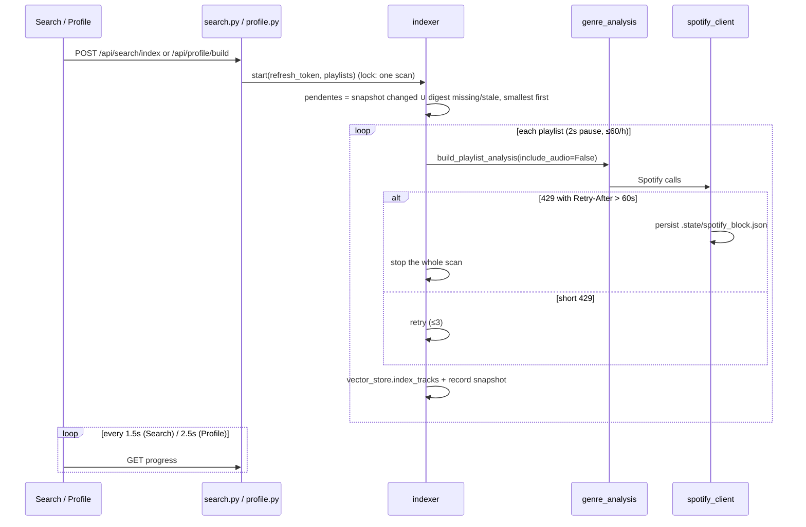
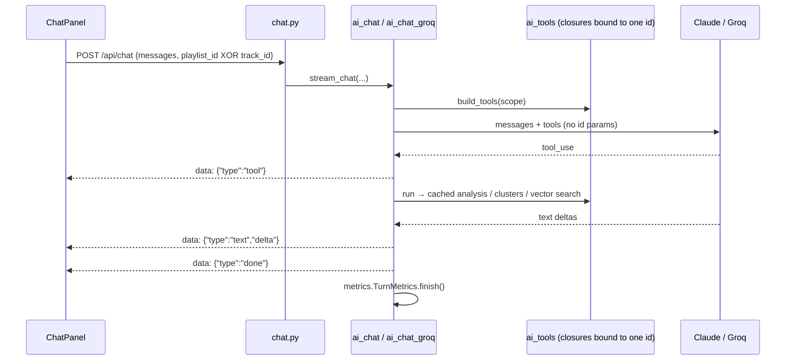

# Codebase Map

> Auto-generated by Cartographer. Last mapped: 2026-09-15

Playlist Classifier is a single-user, local-first web app. A FastAPI backend analyzes a Spotify
account's playlists (genres from Last.fm tags, BPM/previews from Deezer), indexes tracks into an
embedded vector store for semantic search, clusters playlists into "mood blocks", builds an
account-wide profile dashboard from on-disk digests, and offers a tool-using LLM chat (Claude or
Groq) scoped to one playlist or track. The same data is exposed to external agents through an MCP
stdio server. The React frontend draws every chart by hand in SVG/canvas. UI copy and most code
comments are pt-BR.

**The single most important constraint:** Spotify previously suspended this app for ~18h for
excessive requests. Every Spotify call goes through `backend/app/spotify_client.py`, and the only
bulk scanner (`indexer.py`) is user-triggered, paced and capped. See [Spotify rate-limit protection](#spotify-rate-limit-protection).

## System Overview



## Directory Structure

```
playlist-classifier/
├── backend/
│   ├── app/                     # FastAPI app (package)
│   │   ├── main.py              # app assembly, middleware, /api/health
│   │   ├── config.py            # pydantic-settings from backend/.env
│   │   ├── models.py            # all Pydantic response models
│   │   ├── cache.py             # process-wide TTLCaches (first level, in front of the DB)
│   │   ├── db.py                # SQLite connection + versioned migrations (DATA_DIR)
│   │   ├── analysis_store.py    # full playlist analyses (by snapshot) + account listings
│   │   ├── enrichment_store.py  # Last.fm tags, Deezer matches, Spotify track metadata (with TTLs)
│   │   ├── auth.py              # OAuth PKCE routes + session token helpers
│   │   ├── spotify_auth.py      # refresh-token → access-token (no session; MCP/scripts)
│   │   ├── spotify_client.py    # ★ every Spotify call; throttle + persisted global block
│   │   ├── deezer_client.py     # BPM + preview (two implementations in one file!)
│   │   ├── lastfm_client.py     # genre tags (only genre source)
│   │   ├── genre_analysis.py    # build_playlist_analysis, add_audio (+ persists everything)
│   │   ├── playlists.py         # /api/playlists routes, analysis_for_user (permission + store)
│   │   ├── tracks.py            # /api/tracks routes
│   │   ├── search.py            # /api/search routes (semantic search + index control)
│   │   ├── profile.py           # /api/profile routes (reads local state only)
│   │   ├── profile_stats.py     # pure aggregation for the dashboard
│   │   ├── profile_store.py     # per-playlist digests in SQLite (imports old JSON)
│   │   ├── indexer.py           # ★ the only bulk Spotify scanner
│   │   ├── vector_store.py      # ChromaDB + MiniLM ONNX embeddings
│   │   ├── clustering.py        # TF-IDF → SVD → k-means mood clusters
│   │   ├── chat.py              # /api/chat routes (SSE)
│   │   ├── ai_chat.py           # provider selection + Anthropic adapter
│   │   ├── ai_chat_groq.py      # Groq (OpenAI-compatible) adapter
│   │   ├── ai_tools.py          # provider-neutral tools, scope enforcement, prompts
│   │   ├── metrics.py           # in-memory per-turn token/latency ring buffer
│   │   └── mcp_server.py        # MCP stdio server (python -m app.mcp_server)
│   ├── evals/                   # golden.yaml + run_evals.py (real LLM, fixture data)
│   ├── scripts/                 # spotify_refresh_token.py (mint SPOTIFY_REFRESH_TOKEN)
│   ├── tests/                   # pytest suite, no network
│   ├── Dockerfile, pytest.ini, requirements.txt, .env.example
│   ├── .data/ .chroma/ .state/   # runtime state (gitignored); .profile_cache/ is legacy, imported
├── frontend/
│   ├── src/
│   │   ├── main.jsx, App.jsx    # bootstrap, navbar, routes
│   │   ├── api.js               # single HTTP client
│   │   ├── AuthContext.jsx      # user/session state
│   │   ├── PlayerContext.jsx    # singleton <audio> + Web Audio analyser
│   │   ├── audioAnalysis.js     # client-side waveform peaks + spectral metrics
│   │   ├── index.css            # entire design system (~3.2k lines)
│   │   ├── pages/               # Login, PlaylistList, PlaylistDetail, TrackDetail, Search, Profile
│   │   ├── components/          # charts, chat, player, tables
│   │   └── charts/              # chartKit.js, ChartTooltip, GenreFlow
│   ├── Dockerfile, nginx.conf, vite.config.js, package.json
├── .github/workflows/ci.yml     # backend tests, frontend build, docker build, manual evals
├── .claude/launch.json          # local dev launchers (uvicorn --reload, vite)
├── docker-compose.yml           # backend + nginx frontend, named volumes for state
└── docs/CODEBASE_MAP.md
```

## Module Guide

### Backend: app assembly and config

| File | Purpose | Tokens |
|------|---------|--------|
| `backend/app/main.py` | FastAPI app, `SessionMiddleware`, CORS (exposes `Retry-After`), mounts 6 routers, `GET /api/health` → `{status, spotify_throttled}` | 380 |
| `backend/app/config.py` | `Settings` + `get_settings()` (`lru_cache`), reads `backend/.env` by absolute path | 506 |
| `backend/app/models.py` | `PlaylistSummary`, `TrackGenreInfo`, `TrackDetail`, `PlaylistAnalysis`, `GenreCount`, `ClusterInfo`/`ClusterPoint`/`PlaylistClusters`, `SearchHit`, `SearchStatus`, `IndexStatus` | 1186 |
| `backend/app/cache.py` | TTLCaches (see table below) | 498 |

**Environment variables** (`config.py`):

| Var | Default | Notes |
|---|---|---|
| `SPOTIFY_CLIENT_ID` / `SPOTIFY_CLIENT_SECRET` | required | |
| `SPOTIFY_REDIRECT_URI` | `http://127.0.0.1:8000/api/auth/callback` | must be `127.0.0.1`, not `localhost` |
| `LASTFM_API_KEY` | required | |
| `SPOTIFY_REFRESH_TOKEN` | `""` | only for MCP server / scripts |
| `AUTO_INDEX` | `False` | auto-scan on app open; off because it caused the 18h suspension |
| `CHAT_PROVIDER` | `anthropic` | `anthropic` or `groq` |
| `ANTHROPIC_API_KEY` / `GROQ_API_KEY` | `""` | no key → chat hidden (503), rest of app works |
| `GROQ_MODEL` | `openai/gpt-oss-120b` | must support tool calling |
| `FRONTEND_URL` | `http://127.0.0.1:5173` | CORS + OAuth redirects |
| `SESSION_SECRET` | dev placeholder | signs session cookie |
| `SPOTIFY_SCOPES` | `playlist-read-private playlist-read-collaborative user-library-read` | |

**Caches** (`cache.py`, in-process, lost on restart):

| Cache | Size / TTL | Why |
|---|---|---|
| `artist_tags_cache` | 5000 / 24h | Last.fm artist tags |
| `track_tags_cache` | 10000 / 24h | Last.fm track tags |
| `deezer_cache` | 5000 / 30min | short: Deezer preview URLs are signed and expire |
| `track_detail_cache` | 5000 / 25min | just under `deezer_cache` TTL |
| `playlist_analysis_cache` | 200 / 10min | shared by page + chat tools |
| `deezer_track_cache` | 10000 / 24h | newer Deezer API path |
| `user_playlists_cache` | 64 / 5min | `/me/playlists` listing (the most rate-limited Spotify call) |

### Backend: auth

| File | Purpose | Tokens |
|------|---------|--------|
| `backend/app/auth.py` | PKCE OAuth routes; `get_valid_access_token(request)`, `get_me(request, token)` | 1609 |
| `backend/app/spotify_auth.py` | `access_token_from_refresh_token()`, `SpotifyAuthError`, token URL constants | 372 |
| `backend/scripts/spotify_refresh_token.py` | CLI: local HTTP server on the redirect port, full PKCE, prints `SPOTIFY_REFRESH_TOKEN=...` (backend must be stopped) | 1169 |

Routes (`/api/auth`): `GET /login` (302 to Spotify, stores `oauth_state` + verifier in session) ·
`GET /callback` (exchanges code, 302 to `{FRONTEND_URL}/playlists` or `/login?error=...`) ·
`GET /me` → `{id, display_name, image}` · `POST /logout`.

Tokens live only in the signed session cookie, never in JS. `expires_at` has a 30s safety margin.
`get_me` caches the profile in the session for 12h and **never raises** on a Spotify failure: it
returns the cached profile or `{}`. Previously a 429 here became a 401 and logged the user out.

### Backend: external data clients

| File | Purpose | Tokens |
|------|---------|--------|
| `backend/app/spotify_client.py` | `SpotifyClient` (`get_me`, `get_current_user_id`, `get_track`, `get_all_playlists`, `get_playlist`, `get_all_playlist_tracks`), `is_accessible_playlist`, `gather_with_concurrency`, `throttle_state`, `global_block_remaining` | 2734 |
| `backend/app/lastfm_client.py` | `get_track_tags` (subgenre, excludes artist's own name), `get_artist_tags` (broad genre); filters `NOISE_TAGS`; memory → DB → network. Errors return `[]` and are never stored; only Last.fm error 6 ("not found") is stored as `[]` | 807 |
| `backend/app/deezer_client.py` | BPM + 30s preview, keyless. **Two implementations back to back:** old pt-BR `buscar_faixa` (used by `tracks.py`, `deezer_cache`, returns `confianca`) and new `get_track_info` / `get_many` (used by `genre_analysis`/`indexer`, `deezer_track_cache` + DB, returns `deezer_id`, concurrency 6), plus `get_preview_url(deezer_id)` | 3566 |

Spotify API facts baked into the client (2024–2026 API changes):
- `/playlists/{id}/tracks` was removed; the client uses `/playlists/{id}/items`. `added_at` comes from the entry, not the track.
- `preview_url`, `audio-features` and artist `genres` are gone. Deezer and Last.fm fill those gaps.
- `/playlists/{id}/items` returns 403 for playlists the user only follows, so `get_all_playlists` keeps only owned or collaborative playlists (`is_accessible_playlist`).

Deezer matching: it tries a strict `artist:"x" track:"y"` query, then free text. Both sides are
normalized (accents, "Remastered", "feat."), and durations must be within 12s. A live, remix or
acoustic version only matches the same kind of version. `bpm: 0` means unknown and becomes `None`.
Roughly 43% of tracks have a BPM and 93% have a preview.

### Backend: analysis core

| File | Purpose | Tokens |
|------|---------|--------|
| `backend/app/genre_analysis.py` | `build_playlist_analysis(access_token, playlist_id, *, include_audio=True, trust_cache=True)` → `PlaylistAnalysis`; `add_audio(analysis)`; `_bpm_histogram`, `_release_year` | 2636 |
| `backend/app/clustering.py` | `cluster_playlist(analysis)` → `ClusterResult`; `MIN_FAIXAS=12`, `MAX_K=6` | 1887 |

`build_playlist_analysis`:
- Fetches Spotify metadata and tracks, then gathers Last.fm artist tags, Last.fm track tags and Deezer at the same time. `LASTFM_CONCURRENCY=24` came from benchmarks.
- Concurrent requests for the same `(playlist_id, include_audio)` share one task (`_in_flight` + `asyncio.shield`).
- `include_audio=False` (used by scans) skips Deezer. That result is **never** stored in `playlist_analysis_cache`, so the playlist page never shows empty BPM.
- `trust_cache=False` skips the memory cache and in-flight tasks and goes to Spotify. Use it whenever permission hasn't been checked yet: Spotify's 403 is the permission check.
- It never reads the database. Serving stored analyses is `playlists.analysis_for_user`'s job.
- Side effect (`_persist`, best effort): saves the full analysis (`analysis_store`), the profile digest (`profile_store`) and the Spotify track metadata (`enrichment_store`). An audio-less save never overwrites an audio save of the same snapshot.
- `add_audio(analysis)` completes a stored audio-less analysis (from a scan) with Deezer only, with no Spotify calls.

`cluster_playlist`:
- Tags are split on `" | "` and fed through TF-IDF (`min_df=2`, sublinear), then `TruncatedSVD`.
- Duration and popularity are added at 0.35 weight. k-means tries k=2..6 and keeps the best silhouette score.
- Labels use each cluster's *distinctive* tags (cluster mean minus overall mean), not the most frequent ones. A separate 2D SVD gives the scatter coordinates.
- Runs in `asyncio.to_thread`. It returns an explanatory `note` instead of clusters when there are fewer than 12 tagged tracks, fewer than 2 terms, or no valid k.
- BPM is deliberately left out.

### Backend: HTTP routers

| File | Tokens | Routes |
|------|--------|--------|
| `backend/app/playlists.py` | 2604 | `GET /api/playlists[?refresh]` → `list[PlaylistSummary]` · `GET /{id}/analysis[?refresh]` → `PlaylistAnalysis` · `GET /{id}/clusters` → `PlaylistClusters` |
| `backend/app/tracks.py` | 1013 | `GET /api/tracks/{id}` → `TrackDetail` (Spotify metadata from the DB when known) · `GET /preview/{deezer_id}` → `{preview_url}` · `GET /{id}/similar?limit=8` → `list[SearchHit]` |
| `backend/app/search.py` | 886 | `GET /api/search?q&limit=20` · `GET /status` → `SearchStatus` · `POST /index[?auto]` · `GET /index` · `DELETE /index` → `IndexStatus` |
| `backend/app/profile.py` | 1416 | `GET /api/profile` → `{user, overview, coverage, stats, index, build, spotify_blocked_seconds}` · `GET/POST/DELETE /build` → `IndexStatus` |
| `backend/app/chat.py` | 556 | `GET /api/chat/status` → `{available, provider}` (no auth) · `GET /metrics?limit=50` · `POST /api/chat` → SSE |

All routes except `/health`, `/auth/login`, `/auth/callback` and `/chat/status` require a session.

`playlists.py` helpers shared elsewhere:
- `get_playlist_summaries(request, refresh)` is also used by profile and search.
- `_spotify_error(exc)` turns Spotify errors into pt-BR `HTTPException`s. A 429 keeps its `Retry-After` header.
- `wait_text(seconds)` formats waits like `"~18 h (até 10:57)"`.
- `_user_cache_key(request)` is `spotify:{user id}` from the session (falls back to a SHA-256 of the refresh token for old sessions).
- `known_playlists(request)` is the last known listing of any age; it only calls Spotify if the account never listed anything.
- `analysis_for_user(request, playlist_id, *, refresh)` → `(analysis, fetched_now)`. It is the **only** way routes read analyses: stored (listing snapshot matches) → stored without audio + `add_audio` → Spotify. A playlist that isn't in the account's listing is never served from the DB or memory cache (`trust_cache=False`). Used by `/analysis`, `/clusters` and `POST /api/chat`.

The playlist listing is also stored in SQLite (`playlist_listings`). During a Spotify block it is
served instead of failing. `analyze_playlist` schedules vector indexing as a `BackgroundTasks`
job only when the analysis was fetched now, so indexing adds no Spotify calls.

`search.py`: `POST /index?auto=true`, which the frontend sends on open, does nothing unless
`AUTO_INDEX=true`. An explicit POST always starts a scan. Starting a scan needs a `refresh_token`
in the session, because the scan outlives the 1h access token.

`profile.py`:
- `GET /api/profile` only reads local state: the cached listing, digests in SQLite and Chroma metadata. It calls Spotify only if the 5-minute listing cache has expired.
- Stale digests still count toward the stats.
- Index stats are recomputed only when the Chroma count changes.
- On a 429 it falls back to an empty playlist list instead of failing.
- `POST /build` starts the same `indexer.start()` scan as search, so the two never run separate scans.

### Backend: account scan, vector index, profile

| File | Purpose | Tokens |
|------|---------|--------|
| `backend/app/indexer.py` | `start(refresh_token, playlists)`, `cancel()`, `progress()`/`progress_dict()`, `coverage()`, `pendentes_da_conta()`, `estimar_chamadas()` | 2898 |
| `backend/app/vector_store.py` | `index_tracks`, `search(consulta, limite, track_ids=None)`, `similar_to_track`, `stats`, `all_metadata` | 2094 |
| `backend/app/profile_store.py` | `digest_from_analysis`, `load`, `save`, `is_fresh`, `clear_memo`; `VERSION=1` | 1178 |
| `backend/app/db.py` | `query`, `query_one`, `execute`, `executemany`, `transaction`, `use_path` (tests), `close`; `MIGRATIONS` (append-only, `PRAGMA user_version`) | — |
| `backend/app/analysis_store.py` | `load(playlist_id, snapshot_id)` → `StoredAnalysis`, `save(analysis, has_audio)`, `load_listing`, `save_listing`; `ANALYSIS_FORMAT=1` | — |
| `backend/app/enrichment_store.py` | get/put for Last.fm artist and track tags, Deezer matches and Spotify tracks, each with a TTL | — |
| `backend/app/profile_stats.py` | Pure, no I/O: `build_profile_stats(playlists, digests)`, `build_index_stats(metadatas)`, `effective_count` | 2517 |

`indexer.py` merged two older per-feature scans after their combined volume caused the suspension. Its rules:
- It never starts on its own; only a user action does, unless `AUTO_INDEX=true`.
- A playlist is queued when its `snapshot_id` doesn't match the index, or when its profile digest is missing or stale. Smallest playlists go first.
- Playlists are processed one at a time, with a 2s pause (`PAUSA_ENTRE_PLAYLISTS`) and at most 60 per hour (`MAX_PLAYLISTS_POR_HORA`). When the hourly limit is hit, it waits.
- Scans run with `include_audio=False`, so Deezer is never called.
- A queued playlist whose analysis for the same snapshot is already stored (e.g. only the index was wiped) is indexed from the DB, without Spotify, the pause or the hourly limit.
- A short 429 is retried up to 3 times. A long 429 (over 60s) stops the whole scan, and the block is saved to disk.
- The access token is refreshed after 50 minutes. An `asyncio.Lock` ensures only one scan runs.
- State is kept in `backend/.chroma/indexed_playlists.json` (`{playlist_id: snapshot_id}`), next to Chroma on purpose: wiping `.chroma` also resets coverage.
- `coverage` and `pendentes_da_conta` read the disk synchronously, so callers must run them in a thread.

`vector_store.py`:
- Uses an embedded persistent ChromaDB at `backend/.chroma`, collection `faixas`, with **cosine** distance.
- Embeddings come from `DefaultEmbeddingFunction` (all-MiniLM-L6-v2, ONNX, CPU, no key). It loads lazily on first use and is baked into the Docker image.
- There is one document per track, formatted as `name — artists. Álbum: X. Tags: …`. Writes are upserts.
- Playlist-scoped search filters by an id list, not metadata.
- `similar_to_track` reuses the stored embedding and excludes the track itself.
- `similaridade = 1 - distance`, which can be slightly negative.

`profile_store.py`:
- Digests are saved to the `playlist_digests` table, behind an in-memory memo. On the first read per process, old JSON digests in `backend/.profile_cache/` are imported (`INSERT OR IGNORE`).
- Freshness depends only on `snapshot_id`. If either snapshot id is missing, the digest counts as fresh.
- Digests are keyed by playlist, not by user. Access control comes from Spotify's own listing.

`profile_stats.py`:
- Artist, genre and decade stats count **unique tracks**, deduplicated by id.
- The activity timeline counts **entries** (track + playlist pairs).
- `effective_count` is the exponential of Shannon entropy.
- `1970-01-01` add dates are treated as unknown.
- Missing months on the timeline are filled with zeros.

### Backend: AI chat and MCP

| File | Purpose | Tokens |
|------|---------|--------|
| `backend/app/ai_tools.py` | `Tool` dataclass, `*_json` workers, `build_tools(access_token, *, playlist_id \| track_id)`, `system_prompt()` | 3809 |
| `backend/app/ai_chat.py` | `active_provider()`, `stream_chat(...)` async SSE generator; Anthropic via `client.beta.messages.tool_runner`, `MODEL="claude-opus-5"`, adaptive thinking | 1500 |
| `backend/app/ai_chat_groq.py` | Hand-written OpenAI-style tool loop, `MAX_ITERATIONS=4`, memoizes identical tool calls, one final wrap-up completion when the limit is hit | 1716 |
| `backend/app/metrics.py` | `TurnMetrics`, `recent()`, `summary()` (median TTFT/total per provider), deque of 200, not persisted | 1120 |
| `backend/app/mcp_server.py` | stdio MCP server: `listar_playlists`, `analisar_playlist(playlist_id)`, `analisar_faixa(track_id)`; refreshes its token on every call | 1210 |

**How chat scope is enforced:**
- `build_tools` binds `playlist_id` or `track_id` inside closures, and no tool schema has an id parameter. The model has no way to ask for another resource.
- `ChatRequest` requires exactly one of the two ids, at most 20 messages, and at most 4000 characters per message.

Tools by scope:
- Playlist scope: `analisar_esta_playlist`, `buscar_nesta_playlist(consulta)` (limited to the playlist's own track ids), `grupos_desta_playlist`.
- Track scope: `analisar_esta_faixa` and `faixas_parecidas`. The latter deliberately searches the whole index, and the prompt says to disclose that.

Tool workers return JSON error strings instead of raising. Payloads are capped: 40 tracks, 15 genres, 12 search hits.

SSE event types: `tool`, `text`, `done` and `error`. If the client disconnects, the agent task is cancelled.

### Evals and tests

| File | Covers | Tokens |
|------|--------|--------|
| `backend/evals/golden.yaml` | 6 cases (genres, mood search, blocks, out-of-scope refusal, track data, similar); `ferramentas` / `contem` / `nao_contem`; a global check that every "Block Track n" mentioned exists | 600 |
| `backend/evals/run_evals.py` | Real LLM, fixture data (patches `ai_tools.build_playlist_analysis`/`build_track_detail`), temporary Chroma; `--provider`, `--caso`, `--verbose`; exit 1 on failure, 2 on misconfiguration | 2004 |
| `tests/conftest.py` | autouse `spotify_state_tmp` (isolates block state), `analysis` (3 clean blocks), `analysis_sobreposta`, `track_detail`, `chroma_tmp` | 1437 |
| `tests/test_spotify_client.py` | accessibility filter, pagination, `added_at`, throttle-key collapsing, global block persisting across restart, per-route short throttle | 1446 |
| `tests/test_spotify_protection.py` | `get_me` caching and never logging out on 429, listing served from disk during a block, `wait_text`, `build_index_stats` | 1354 |
| `tests/test_indexer.py` | snapshot diffing, state file corruption, single scan, long vs short 429, hourly cap, `coverage` makes no Spotify calls | 2198 |
| `tests/test_profile.py` | profile stats math, digest store and audio-downgrade rule, `is_fresh`, queue ordering, `include_audio=False` skipping Deezer and the cache, in-flight dedupe | 2738 |
| `tests/test_clustering.py` | recovers 3 blocks, distinctive labels, small or tagless playlists, low silhouette on overlapping blocks | 931 |
| `tests/test_vector_store.py` | real ONNX: semantic neighbors, scoped filter doesn't leak, similar tracks, upsert, empty cases | 941 |
| `tests/test_scope.py` | tool schemas have no id params, exactly one scope id, history cap | 611 |
| `tests/test_metrics.py` | aggregation, errors, ring buffer eviction, TTFT set once | 473 |

The tests make no network calls. `pytest.ini` sets `asyncio_mode = auto` and `testpaths = tests`.

### Frontend: core

| File | Purpose | Tokens |
|------|---------|--------|
| `frontend/src/main.jsx` | `StrictMode` + `BrowserRouter` + `App` | 71 |
| `frontend/src/App.jsx` | `AuthProvider` > `PlayerProvider` > `Navbar` + routes + `NowPlayingBar`; `RequireAuth` | 1029 |
| `frontend/src/api.js` | the `api` object (below) and `formatWait(seconds)` | 1038 |
| `frontend/src/AuthContext.jsx` | `useAuth()` → `{user, loading, refresh, logout}`; failed `me()` means logged out | 207 |
| `frontend/src/PlayerContext.jsx` | `usePlayer()` → `{track, playing, time, duration, erro, analyserRef, playTrack, toggle, seek, stop}`; one `<audio crossOrigin>` and a lazily created `AudioContext` → `AnalyserNode` (fft 2048) | 971 |
| `frontend/src/audioAnalysis.js` | `calcularPicos`, `calcularMetricas` (peak/RMS dB, crest, centroid, bass/mid/treble %), `analisarPrevia(url)`; custom FFT. A BPM detector was built, then **removed** (60% precision) | 2009 |
| `frontend/src/index.css` | Whole design system: tokens (`--void #0a0a0a`, `--surface #181818`, `--green #1ed760`, `--on-green` black), Manrope font, radii, glass for floating UI; sections per page/component; breakpoints at 960px and 720px; handles `prefers-reduced-motion` | 18892 |

**Client routes** (everything except `/login` is wrapped in `RequireAuth`):

| Path | Page |
|---|---|
| `/login` | `Login` |
| `/playlists` | `PlaylistList` |
| `/playlists/:id` | `PlaylistDetail` |
| `/faixa/:id` | `TrackDetail` |
| `/busca` | `Search` |
| `/perfil` | `Profile` |
| `*` | redirect to `/playlists` |

**Backend endpoints called by `api.js`:**

| Function | Method + path | Deduped | Called from |
|---|---|---|---|
| `me` | GET `/api/auth/me` | ✓ | AuthContext |
| `logout` | POST `/api/auth/logout` | | AuthContext / Navbar |
| `loginUrl` | (link) `/api/auth/login` | | Login |
| `listPlaylists({refresh})` | GET `/api/playlists` | ✓ | PlaylistList |
| `getPlaylistAnalysis` | GET `/api/playlists/{id}/analysis` | ✓ | PlaylistDetail |
| `getPlaylistClusters` | GET `/api/playlists/{id}/clusters` | | ClusterPanel |
| `getTrack` | GET `/api/tracks/{id}` | | TrackDetail |
| `getSimilarTracks` | GET `/api/tracks/{id}/similar` | | TrackDetail |
| `search` | GET `/api/search` | | Search |
| `searchStatus` | GET `/api/search/status` | | Search |
| `indexStatus` / `startIndex` / `stopIndex` | GET / POST / DELETE `/api/search/index` | | Search |
| `getProfile` | GET `/api/profile` | ✓ | Profile |
| `getProfileBuild` / `buildProfile` | GET ✓ / POST `/api/profile/build` | | Profile |
| `chatStatus` | GET `/api/chat/status` | ✓ | PlaylistDetail, TrackDetail |
| `chatStream` | POST `/api/chat` (raw stream) | | ChatPanel |

`api.js` behavior:
- The base URL is `VITE_API_URL` (default `http://127.0.0.1:8000`), and every request uses `credentials: "include"`. There is no Vite proxy.
- Errors carry `.status`, `.retryAfter` and the backend's `detail`.
- The `inFlight` Map shares one pending promise between identical GETs. That covers StrictMode's double effects. Actions (POST/DELETE) are never deduped.

### Frontend: pages

| File | Purpose | Tokens |
|------|---------|--------|
| `pages/Login.jsx` | Landing page, `<a href={loginUrl}>` button, maps `?error=` to messages, decorative `SoundRibbon` | 731 |
| `pages/PlaylistList.jsx` | Playlist grid, client-side filter, "Atualizar" (`refresh=true`) keeps the grid dimmed instead of showing skeletons, generated cover placeholder for playlists without art, retry with `formatWait` on 429/502 | 1550 |
| `pages/PlaylistDetail.jsx` | Hero stats, `GenreFlow`, genre/subgenre bars, `BpmChart`, `TopArtistsChart`, `ClusterPanel`, `TrackTable`, `ChatWidget scope="playlist"`; `colorFor` keeps bar colors in sync with GenreFlow's top 5 | 1452 |
| `pages/TrackDetail.jsx` | `Waveform`, `AudioMetrics`, tags, similar tracks (reuses `SearchHit` from Search.jsx; an error shows as `[]`), `ChatWidget scope="track"`, note when the match is "aproximada" | 1687 |
| `pages/Search.jsx` | Semantic search, coverage panel, index start/stop; polls `indexStatus` every 1.5s **on mount** and stops when the scan isn't running, so it picks up a scan started from Profile. Exports `SearchHit` | 2330 |
| `pages/Profile.jsx` | Account dashboard (top artists/genres/tags, decades, add timeline, repeated tracks, playlist table), coverage, "Analisar as que faltam" button, block countdown | 6556 |

`Profile.jsx` loading, designed to never trigger Spotify on its own:
1. On open it calls `getProfile()` once.
2. If `build.running`, it polls the lightweight `getProfileBuild()` every 2.5s with a self-rescheduling `setTimeout`. It calls `getProfile()` again only when `done` changes or the scan ends.
3. A scan starts only when the user clicks the button (`buildProfile()`).
4. While Spotify is blocked, the build button is hidden and a countdown is shown.
5. When coverage is partial, the page says so ("X de Y playlists") and hides stats that need full coverage.

### Frontend: components and charts

There is **no chart library**. All charts are hand-built SVG, HTML or canvas on top of `charts/chartKit.js`.

| File | Purpose | Tokens |
|------|---------|--------|
| `charts/chartKit.js` | `SERIES` (6 colorblind-validated colors; **don't reorder**, extra categories go into "outros"), `NEUTRAL`, `SURFACE`, `GRID`, `INK*`, `useWidth()` (callback ref + ResizeObserver), `useMounted()`, `prefersReducedMotion()`, `smoothPath` (monotone, never overshoots), `gaussianSmooth`, `pct`, `plural` | 1429 |
| `charts/ChartTooltip.jsx` | Absolute-positioned HTML tooltip that flips left near the right edge | 142 |
| `charts/GenreFlow.jsx` | Streamgraph of genre share along the track order; `buildFlow`, `FLOW_SERIES_LIMIT=5`; hidden below 6 tracks; includes an `sr-only` data table | 3516 |
| `components/DistributionBarChart.jsx` | Most reused chart: HTML `<ol>` bars, `limit` with an "N outros" row, `colorFor`, `detailFor`, three-state `foot` | 935 |
| `components/TopArtistsChart.jsx` | Preset wrapper around DistributionBarChart (limit 8) | 96 |
| `components/ColumnChart.jsx` | Column chart for ordered categories (Profile decades/timeline), rounded axis max, tick thinning that falls back to `major`/`majorLabel` labels | 1841 |
| `components/BpmChart.jsx` | Dot per track plus a Gaussian density curve (bandwidth 6), shaded tempo zones | 2598 |
| `components/ClusterPanel.jsx` | Fetches clusters; scatter plot with a color **and** marker shape per cluster, halos, label collision avoidance; renders nothing if there are no clusters and no note | 2860 |
| `components/TrackTable.jsx` | Filterable track table with play buttons and a playing-bars indicator; exports `PlayIcon`/`PauseIcon` | 1264 |
| `components/Waveform.jsx` | Live canvas spectrum and oscilloscope from `analyserRef`; the draw loop runs only while this track plays | 1515 |
| `components/AudioMetrics.jsx` | Runs `analisarPrevia`, draws a static waveform canvas (click to seek or play), metric tiles | 1873 |
| `components/NowPlayingBar.jsx` | Always-mounted mini player; clicking opens `/faixa/:id`, controls use `stopPropagation`; the seek bar has no keyboard support | 945 |
| `components/ChatWidget.jsx` | Floating button + drawer; mounts `ChatPanel` on first open and keeps it mounted; uses `inert` when closed; Escape and focus handling | 1127 |
| `components/ChatPanel.jsx` | Parses SSE by hand; renders assistant messages with `react-markdown` + `remark-gfm`; `TOOL_LABELS` status text; `key={scopeKey}` resets when the scope changes | 1249 |
| `components/AnalysisLoader.jsx` | Rotating joke phrases and a progress bar that tops out at 94% | 647 |
| `components/SoundRibbon.jsx` | Decorative animated SVG: rAF writes `path[d]` directly, about 30fps, pauses off-screen or in a hidden tab, static when reduced motion is on | 1301 |
| `components/BackLink.jsx` | "← Voltar", a `<Link to>` or a `<button onClick>` | 170 |

Component tree:

```
App
├─ Navbar
├─ /login          Login → SoundRibbon
├─ /playlists      PlaylistList
├─ /playlists/:id  PlaylistDetail → AnalysisLoader(SoundRibbon), GenreFlow, DistributionBarChart×2,
│                                   BpmChart, TopArtistsChart, ClusterPanel, TrackTable, ChatWidget→ChatPanel, BackLink
├─ /faixa/:id      TrackDetail → Waveform, AudioMetrics, SearchHit, ChatWidget→ChatPanel, BackLink
├─ /busca          Search (SearchHit, Cobertura)
├─ /perfil         Profile → ColumnChart, DistributionBarChart
└─ NowPlayingBar   (outside the routes and the .page-enter animation)
```

### Infra

| File | Purpose |
|------|---------|
| `docker-compose.yml` | `backend`: `127.0.0.1:8000`, `env_file backend/.env`, named volumes `data`, `chroma`, `profile_cache` (legacy import), `state`. `frontend`: nginx, `127.0.0.1:5173→80`, build arg `VITE_API_URL`. Also the workaround for the OneDrive/uvicorn reload problem |
| `backend/Dockerfile` | python:3.12-slim, pre-downloads the ONNX embedding model at build time, copies `app`/`evals`/`tests` (not `scripts`), `VOLUME /srv/.chroma` |
| `frontend/Dockerfile` | node:22 build → nginx:alpine; `VITE_API_URL` is **baked in at build time** (changing it requires a rebuild) |
| `frontend/nginx.conf` | SPA fallback to `index.html`, 1-year immutable cache for `/assets/`, gzip |
| `.github/workflows/ci.yml` | `backend` (pytest, dummy env vars, cached ONNX model), `frontend` (`npm ci && build`), `docker` (build only), `evals` (manual `workflow_dispatch`, Groq) |
| `.claude/launch.json` | `backend`: `.venv` uvicorn `--reload` on 127.0.0.1:8000; `frontend`: `npm run dev` on 5173 |
| `.gitignore` | ignores `backend/.data/`, `.chroma/`, `.profile_cache/`, `.state/`, `.env*` (except `.example`) and **`CLAUDE.md`** |

## Data Flow

### Login (OAuth PKCE)



### Opening a playlist

```mermaid
sequenceDiagram
    participant FE as PlaylistDetail
    participant P as playlists.py
    participant GA as genre_analysis
    participant SC as spotify_client
    participant LF as Last.fm
    participant DZ as Deezer
    participant VS as vector_store
    participant PS as profile_store

    FE->>P: GET /api/playlists/{id}/analysis
    P->>P: playlist in account listing? stored analysis for its snapshot?
    Note over P: stored with audio → return (no external calls)<br/>stored without audio → add_audio (Deezer only)
    P->>GA: build_playlist_analysis(include_audio=True)
    GA->>SC: get_playlist + get_all_playlist_tracks
    par
        GA->>LF: artist + track tags (24 concurrent)
    and
        GA->>DZ: get_many (6 concurrent)
    end
    GA->>PS: save analysis + digest + track metadata (SQLite, best-effort)
    GA-->>P: PlaylistAnalysis
    P-->>FE: JSON (tracks carry deezer_id; preview resolved on play)
    P--)VS: BackgroundTask index_tracks (no new API calls)
    FE->>P: GET /{id}/clusters (reuses cached analysis → k-means in thread)
```

### Account scan (search or profile)



### Scoped chat



## Persistence

State that must survive restarts lives in SQLite (`backend/.data/app.sqlite3`, or `DATA_DIR`):

| Table | Written by | Valid while |
|-------|------------|-------------|
| `playlist_analyses` | `genre_analysis._persist` | `snapshot_id` unchanged (`ANALYSIS_FORMAT` bump invalidates) |
| `playlist_digests` | `profile_store.save` | `snapshot_id` unchanged |
| `playlist_listings` | `playlists.get_playlist_summaries` | refreshed after 5 min when listing; any age for permission |
| `lastfm_artist_tags`, `lastfm_track_tags` | `lastfm_client` | 30 days |
| `deezer_matches` | `deezer_client.get_track_info` | 30 days (7 days for "not found") |
| `spotify_tracks` | analyses and `tracks.build_track_detail` | 30 days |

Rules:
- **Only real answers are stored.** Network errors, Last.fm error codes other than 6 and Deezer quota errors return empty data to the caller but are never written.
- **Deezer preview URLs are never stored** (signed, expire in minutes). Tracks keep `deezer_id`; `PlayerContext` calls `GET /api/tracks/preview/{deezer_id}` when playing.
- **Permission comes from the account's listing.** Analyses are keyed by playlist only; `analysis_for_user` is the gate.
- **Migrations are append-only** (`db.MIGRATIONS`). They run at startup (`main.lifespan`).
- One shared connection behind a lock, WAL mode. The app must run as a single instance anyway (the Spotify throttle lives in the process).

## Spotify Rate-Limit Protection

The anti-ban design spans several layers:

1. **One funnel.** Every Spotify request goes through `SpotifyClient._get` in `spotify_client.py`.
2. **Per-endpoint throttle.** Ids in the path are collapsed into `{id}` before checking the throttle, so opening a different playlist doesn't count as a fresh endpoint. A throttled endpoint fails immediately with a synthetic 429 and makes no network call.
3. **Global block.** A `Retry-After` over 60s (`GLOBAL_BLOCK_SECONDS`) blocks *all* Spotify calls. The block is saved to `backend/.state/spotify_block.json`, so restarting the backend doesn't lift it. It is reported in `/api/health` and in the Profile page.
4. **Bounded retries.** A 429 is retried at most 2 times, and only when the wait is 8s or less. Longer waits return an error to the caller.
5. **Caching and persistence.** `user_playlists_cache` (5min) plus the listing in SQLite, the `/me` profile kept in the session for 12h, stored analyses by snapshot, stored track metadata, and GET deduplication in the frontend.
6. **One paced scanner.** `indexer.py` is user-triggered, diffs by snapshot, handles one playlist every 2s, stops at 60/hour, never calls Deezer, and stops entirely on a long block.
7. **Profile reads local state.** The Profile page doesn't call Spotify on open.
8. **Evals use fixtures.** The test suite and evals never call Spotify.

When changing anything that calls Spotify, keep all of these intact. `test_spotify_client.py`,
`test_spotify_protection.py` and `test_indexer.py` cover this behavior.

## Conventions

- **Language:** pt-BR for UI copy, many identifiers (`buscar_faixa`, `pendentes`, `similaridade`, `MIN_FAIXAS`), tool names and system prompts. Newer modules use English names. Follow the style of the surrounding file.
- **One router per resource**, each with its own `prefix=/api/<resource>`. Shared Pydantic models go in `models.py`.
- **Persistent state goes in SQLite** (`db.py` + a `*_store.py` module). Remaining file writes (`spotify_client` block, `indexer` state) use atomic `.tmp` + `os.replace`.
- **CPU-bound or disk-reading code** (sklearn, Chroma reads, digest loads) runs in `asyncio.to_thread`.
- **Degrade instead of failing:** Last.fm and Deezer errors return `[]`/`None`, AI tools return JSON error strings, background indexing only logs errors, and `get_me` never raises.
- **Explaining instead of guessing:** clustering returns a `note`, similar-track lookups return `[]` when a track isn't indexed, and stale digests are shown and labeled.
- **Frontend:** no state library. Contexts cover auth and the player; each page keeps its own state and fetches its own data. Async effects use `live`/`alive` guards. Charts use `chartKit` hooks and palettes and include accessible alternatives (shapes, `sr-only` tables, reduced motion).
- **Comments explain why,** often with measured numbers (concurrency benchmarks, BPM detector precision). Keep that habit.

## Gotchas

- **OneDrive + `uvicorn --reload`:** the file watcher misses changes and the backend silently serves stale code. Restart the backend (or use Docker) before debugging.
- **`127.0.0.1`, not `localhost`:** the OAuth redirect, CORS and the SameSite=Lax cookie all assume `127.0.0.1`.
- **`deezer_client.py` has two duplicate implementations.** `tracks.py` uses `buscar_faixa`; `genre_analysis`/`indexer` use `get_many`. They use different caches and matching code. Change both, or consolidate them.
- **Scans skip Deezer.** Those analyses are never cached for the page, but they do write digests. A digest without audio never replaces one with audio for the same snapshot.
- **Stored analyses and digests are keyed by playlist only**, not by user. Always read analyses through `playlists.analysis_for_user`, never `analysis_store.load` directly from a route.
- **Tests use a temporary database** (`db_tmp` autouse fixture in `conftest.py`). Without it the suite would write fake analyses into the real app database.
- **The indexer and its progress are still global** (one scan and one progress object for the whole process), and session cookies still carry the Spotify tokens. Both must change before a multi-user deployment.
- **`AUTO_INDEX` must stay off** unless you accept the ban risk. The frontend sends `POST /index?auto=true` on open; the backend ignores it when the flag is off.
- **Wiping `backend/.chroma`** also resets scan coverage (`indexed_playlists.json` lives there). Deleting `.state/spotify_block.json` removes the persisted block. Don't do that to get around a real ban.
- **`https_only=False`** on the session cookie is only acceptable in dev.
- **`VITE_API_URL` is compiled into the frontend build.** The Docker frontend must be rebuilt to point at a different backend.
- **The README says "Recharts", but there is no chart library.** All charts are custom.
- **`createMediaElementSource` can only be called once per `<audio>` element.** That's why `PlayerContext` owns the single audio element; never create another one for playback analysis.
- **`ChatPanel`'s catch block** replaces the last message, discarding partially streamed text.
- **Metrics live only in memory** and reset when the backend restarts (not yet in SQLite).
- **`CLAUDE.md` is gitignored**, so project instructions are local only.
- **Evals on Windows:** Chroma keeps its sqlite file open, so temporary directories use `ignore_cleanup_errors=True`.

## Navigation Guide

- **Add a backend endpoint:** create or extend a router in `backend/app/<resource>.py`, add response models to `models.py`, register new routers in `main.py`, then add a function to `frontend/src/api.js` (use `get()` for idempotent GETs so they're deduped).
- **Add a Spotify call:** add a method to `SpotifyClient` in `spotify_client.py` (never call `httpx` directly), add a cache in `cache.py`, and add a test in `test_spotify_client.py`. Think about the scan volume.
- **Change genre/tag logic:** `lastfm_client.py` (`NOISE_TAGS`, limits) → `genre_analysis.py` → `profile_store.digest_from_analysis` (bump `VERSION` if the digest shape changes; bump `analysis_store.ANALYSIS_FORMAT` if `PlaylistAnalysis` changes). Stored Last.fm tags last 30 days: clear `lastfm_*` tables if the filtering changes.
- **Persist something new:** append a migration to `db.MIGRATIONS`, add get/put functions in a `*_store.py`, keep network errors out of it, and cover it in `test_persistence.py`.
- **Change BPM or previews:** `deezer_client.py` (both implementations) and `cache.py` TTLs.
- **Add a chat tool:** add a `*_json` worker and a `Tool` in `build_tools` in `ai_tools.py` (no id parameters), a label in `TOOL_LABELS` in `ChatPanel.jsx`, a case in `evals/golden.yaml`, and check `test_scope.py`.
- **Expose data over MCP:** `mcp_server.py`, reusing the `ai_tools` `*_json` workers.
- **Change search or embeddings:** `vector_store.py` (document format, distance) and `test_vector_store.py`. Changing the embedding model requires wiping `.chroma`.
- **Change scan pacing:** `indexer.py` constants and `test_indexer.py`.
- **Add profile stats:** `profile_stats.py` (pure) → `profile.py` response → `Profile.jsx` (+ `ColumnChart`/`DistributionBarChart`) → `test_profile.py`.
- **Add a page:** `frontend/src/pages/X.jsx`, a route in `App.jsx` wrapped in `RequireAuth`, a nav link in `Navbar`, and styles in a new `index.css` section.
- **Add a chart:** use `chartKit` (`SERIES`, `useWidth`, `useMounted`, `smoothPath`) and `ChartTooltip`; add styles under "Gráficos" in `index.css`.
- **Change auth or session:** `auth.py`, `spotify_auth.py`, `main.py` (`SessionMiddleware`), `AuthContext.jsx`.
- **Change the clustering algorithm:** `clustering.py`, `test_clustering.py`, `ClusterPanel.jsx`.
- **Run locally:** `.claude/launch.json` configs, or `docker compose up`. Tests: `cd backend && pytest`. Evals: `python -m evals.run_evals --provider groq`.
