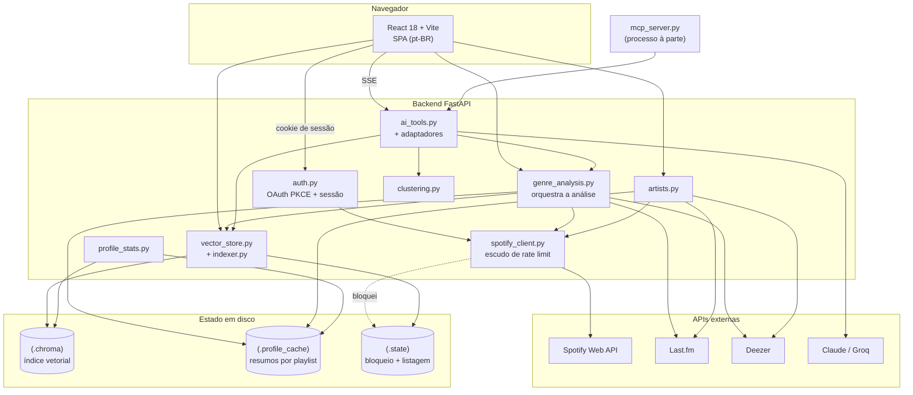
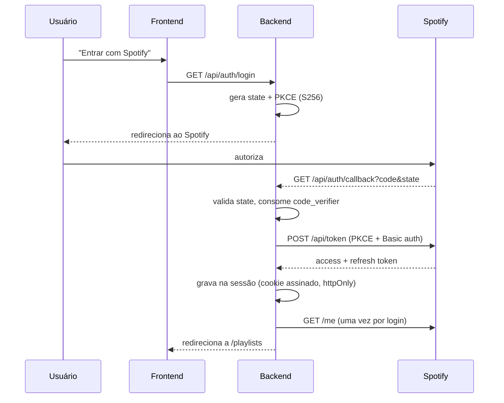
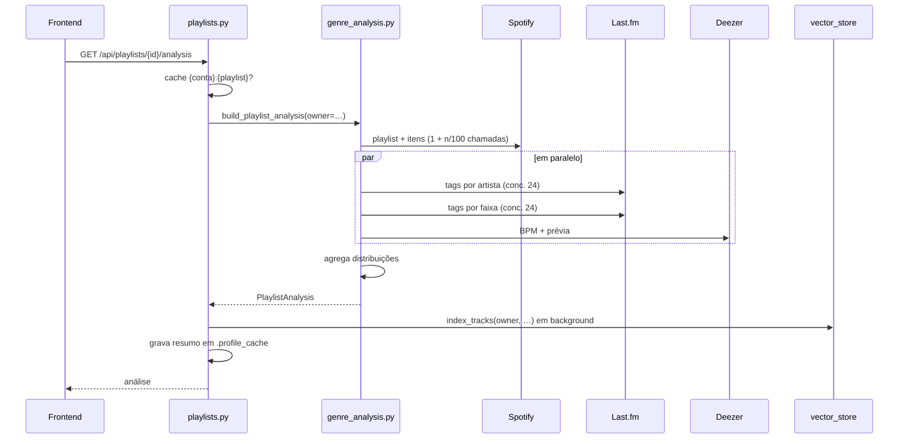

# Codebase Map

> Gerado pelo Cartographer. Último mapeamento: 2026-09-16T10:41:46Z (commit `99a0519`).

## Visão geral

**Playlist Classifier** conecta à conta do Spotify, lista as playlists e analisa a
composição de gênero de cada uma. O eixo do projeto é uma ausência: desde a
migração da API do Spotify em 2026, **o Spotify não fornece mais gênero nenhum**.
Quase toda decisão de arquitetura aqui sai disso — de onde vem o dado que o
Spotify parou de dar, e como pedir esse dado sem levar um ban.

Três fontes externas, com papéis distintos:

| Fonte | Papel | Por quê |
|---|---|---|
| **Spotify** | playlists, faixas, identidade do artista | única fonte da biblioteca do usuário |
| **Last.fm** | gênero (tags de artista), subgênero (tags de faixa), bio, audiência | substitui o campo `genres` removido |
| **Deezer** | BPM, prévia de 30 s, mais tocadas do artista | substitui `audio-features`, `preview_url` e `/top-tracks`, todos 403 |



## Estrutura de diretórios

```
playlist-classifier/
├── backend/                  FastAPI, Python 3.12
│   ├── app/
│   │   ├── main.py               app + middlewares + /api/health
│   │   ├── config.py             env tipado; recusa subir em prod com segredo de exemplo
│   │   ├── auth.py               OAuth PKCE, sessão, user_key()
│   │   ├── spotify_auth.py       troca de refresh token sem sessão (usado pelo MCP)
│   │   ├── spotify_client.py     TODA chamada ao Spotify passa aqui — é o escudo
│   │   ├── playlists.py          /api/playlists, listagem em disco, tradução de erro
│   │   ├── genre_analysis.py     combina Spotify + Last.fm + Deezer numa análise
│   │   ├── lastfm_client.py      tags de artista e faixa, artist.getInfo
│   │   ├── deezer_client.py      BPM, prévia, mais tocadas  ⚠ duas implementações
│   │   ├── artists.py            /api/artists/{id} + índice reverso do acervo
│   │   ├── tracks.py             /api/tracks/{id}
│   │   ├── profile_store.py      resumo por playlist em disco (JSON)
│   │   ├── vector_store.py       Chroma + ONNX; isolamento por conta
│   │   ├── search.py             /api/search
│   │   ├── indexer.py            varredura da conta, com ritmo controlado
│   │   ├── clustering.py         TF-IDF + k-means, k pela silhueta
│   │   ├── profile.py            /api/profile
│   │   ├── profile_stats.py      agregações puras do perfil
│   │   ├── ai_tools.py           ferramentas do agente (neutras de provedor)
│   │   ├── ai_chat.py            adaptador Claude + SSE + dispatcher
│   │   ├── ai_chat_groq.py       adaptador Groq (laço próprio, formato OpenAI)
│   │   ├── chat.py               /api/chat
│   │   ├── mcp_server.py         mesmas ferramentas via MCP, sem navegador
│   │   ├── metrics.py            custo/latência por turno, em memória
│   │   ├── models.py             schemas Pydantic
│   │   └── cache.py              TTLCaches em memória
│   ├── tests/                12 arquivos, sem rede
│   ├── evals/                conjunto dourado contra modelo real (manual)
│   └── scripts/              spotify_refresh_token.py (CLI OAuth p/ o MCP)
├── frontend/                 React 18 + Vite
│   └── src/
│       ├── App.jsx               rotas + navbar + NowPlayingBar
│       ├── api.js                cliente REST + dedupe de GET
│       ├── AuthContext.jsx       sessão
│       ├── PlayerContext.jsx     dono único do <audio> e do grafo Web Audio
│       ├── audioAnalysis.js      DSP no navegador (FFT, picos, métricas)
│       ├── pages/                Login, PlaylistList, PlaylistDetail,
│       │                         TrackDetail, ArtistDetail, Profile, Search
│       ├── charts/               GenreFlow (o gráfico assinatura), chartKit, ChartTooltip
│       ├── components/           14 componentes (tabelas, gráficos, chat, player)
│       └── index.css             ~3.6k linhas — o sistema visual inteiro
└── docs/CODEBASE_MAP.md      este arquivo
```

## Guia de módulos

### O escudo do Spotify — `spotify_client.py`

**A regra mais importante do backend: nenhuma chamada ao Spotify pode sair por
fora deste módulo.** Chamadas por fora foram exatamente o que continuava batendo
numa conta já bloqueada e esticava o bloqueio.

Duas camadas de proteção:

1. **Bloqueio por endpoint** (`_throttled_until`) — chave normalizada por
   `_throttle_key()`, que troca `/playlists/{id}/items` por `/playlists/{id}/items`.
   Sem essa normalização, abrir *outra* playlist parecia um endpoint novo e livre,
   o que anulava a proteção (o limite do Spotify é por rota lógica, não por URL).
2. **Bloqueio global**, gravado em `.state/spotify_block.json` — acionado quando
   o `Retry-After` passa de 60 s, porque aí não é throttle, é suspensão do app
   (já vieram esperas de ~18 h). Grava com `os.replace` atômico e **nunca
   encurta** um bloqueio existente. Persistir em disco é o que faz um restart do
   backend não esquecer a suspensão e recomeçar a provocá-la.

`_raise_if_throttled()` roda antes de cada chamada e levanta um `HTTPStatusError`
429 sintético **sem tocar na rede**. Esperas acima de 8 s não são aguardadas: o
429 sobe para a interface com `Retry-After` para virar contagem regressiva.

### Identidade e isolamento por conta

`auth.user_key(request)` é a **única** função de identidade do app — o id do
Spotify, com um fallback `"anon:<hash do refresh token>"` só para a janela antes
de `me` existir na sessão. Ela existe centralizada de propósito: um caminho novo
não tem como inventar a própria chave e escapar do filtro sem querer.

Onde ela é aplicada:

| Estado | Como separa |
|---|---|
| Índice da busca (Chroma) | id do documento `{conta}:{faixa}` **e** `where={"owner": …}` |
| Cache de análise | chave `{conta}:{playlist}` dentro de `build_playlist_analysis` |
| Análises em voo | chave `(conta, playlist, com_áudio)` |
| Estado da varredura | chave `{conta}:{playlist}` no `indexed_playlists.json` |
| Listagem em disco | nome do arquivo com `sha256(user_key)[:32]` |
| Estatísticas do índice | cache por conta em `profile.py` |
| "No seu acervo" | filtrado pelas playlists que o Spotify acabou de listar |

**Duas barreiras no índice, de propósito.** O prefixo no id impede que o `upsert`
de uma conta sobrescreva a faixa de outra — duas pessoas podem ter a mesma música,
e com o id sendo só o da faixa a segunda apagava a da primeira. O `where` impede
que a busca por vizinho mais próximo, que varre a coleção inteira, devolva a faixa
de um estranho. Uma barreira sozinha não cobre o outro caso.

### Migrações no lugar, nunca reindexação

Dois módulos migram formato antigo em vez de refazer o trabalho, pelo mesmo motivo:
reindexar significa reanalisar playlists no Spotify, e foi isso que rendeu 18 h de
suspensão.

- `vector_store._adopt_legacy()` — documentos sem `owner` são readicionados com
  **os embeddings já gravados**, id novo e metadados corrigidos, e os antigos
  apagados. O modelo ONNX não roda de novo e nada sai para a rede. Roda uma vez
  por coleção carregada (o sinalizador é zerado em `_get_collection`, então trocar
  de coleção nos testes não herda estado). Quem chega primeiro adota tudo — o
  índice antigo não registrava dono, e numa instalação nova não há legado.
- `indexer._carregar_estado(owner)` — chaves sem `:` (formato antigo) são
  reescritas como `owner:playlist` e persistidas na hora.

### Análise de uma playlist — `genre_analysis.py`

O gênero amplo vem das tags do **artista**; o subgênero, das tags da **faixa**.
Cada faixa vale uma unidade dividida entre seus gêneros, então uma faixa com três
tags não pesa três vezes mais que uma com uma.

Concorrência do Last.fm fixada em 24 por medição contra a API real (60 buscas:
8→1,69 s, 16→1,22 s, 24→1,08 s, 32→0,74 s, zero 429). O pool HTTP é de 64 conexões
porque as passadas de artista e de faixa rodam ao mesmo tempo e se estrangulariam
no padrão de 20.

`include_audio=False` (modo da varredura) pula o Deezer e **nunca** entra no
`playlist_analysis_cache`, para a página da playlist não receber BPM vazio.

### Ritmo da varredura — `indexer.py`

Defesa em camadas, toda testada contra restart:
`PAUSA_ENTRE_PLAYLISTS = 2 s` · teto de `MAX_PLAYLISTS_POR_HORA = 60` (deque de
timestamps; ao encher, espera a janela virar) · até 3 tentativas com backoff pelo
`Retry-After` · e a checagem do bloqueio global antes de cada playlist.

Dois botões, uma varredura: `POST /api/search/index` e `POST /api/profile/build`
chamam o mesmo `indexer.start()`.

### O agente — `ai_tools.py` + adaptadores

**O escopo é estrutural, não uma instrução de prompt.** `build_tools()` devolve
ferramentas cujos schemas JSON **não têm nenhum parâmetro de id**: as funções são
closures sobre `access_token`, `owner` e o id da tela. O modelo não tem onde
colocar um id de outra playlist, mesmo que queira. `access_token` e `owner` nunca
aparecem em schema nenhum — são variáveis de closure, invisíveis ao modelo.
`test_scope.py` protege exatamente isso.

Os dois provedores emitem **os mesmos quatro eventos SSE** (`tool`, `text`,
`done`, `error`), então o frontend não sabe qual respondeu.

O MCP reusa as mesmas funções `*_json`, mas **expõe** `playlist_id`/`track_id`
como parâmetros de verdade — ali quem chama é o dono da conta, não um agente
preso a uma tela.

### O gráfico assinatura — `charts/GenreFlow.jsx`

Streamgraph de silhueta: a pilha é centrada verticalmente e **afina onde há
faixas sem gênero**, o que transforma a ausência de dado em forma visível em vez
de um buraco. Sobre ele:

- `describeArc()` gera a frase que descreve o arco ("Sustenta psytrance na maior
  parte e fecha virando para electronic"), por casamento de padrão sobre os três atos.
- `buildActs()` usa o `raw`, não o suavizado — a suavização existe para o desenho
  não tremer, mas a contagem de um trecho tem que ser a real. "outros" nunca vira
  rótulo de ato: dizer que um trecho "é outros" não descreve nada.
- Faixas por gênero, cada uma normalizada **pelo próprio pico** — a fita mostra a
  mistura, as faixas mostram onde cada gênero se concentra, inclusive os pequenos.
- Volume por sombreado: gradiente na espessura de cada fita, brilho na aresta de
  cima, sombra na de baixo, e `drop-shadow` por camada. Contorno escuro em área
  chapada lê como desenho animado; o que separa volumes é a luz.
- Máscara de borda com `maskUnits="userSpaceOnUse"` explícito — no padrão
  (`objectBoundingBox`) a área é relativa à caixa de cada traçado, que muda ponto
  a ponto, e a fita saía cortada no meio.
- Acessível: navegação por setas/Home/End e uma tabela `sr-only` com a parcela de
  cada gênero por quarto da playlist.

### A paleta — `charts/chartKit.js`

```js
export const SERIES = ["#199e70", "#9085e9", "#d95926", "#3987e5", "#c98500", "#d55181"];
```

Validada contra a superfície `#181818`: **nesta ordem**, pares vizinhos passam no
teste de daltonismo (ΔE ≥ 9,4) e as seis têm contraste ≥ 3:1. **A ordem é o
mecanismo de segurança — não reordene nem gere uma sétima cor.** O que passar de
seis vira "outros" em cinza.

`smoothPath()` usa interpolação monotônica (Fritsch–Carlson): passa por todos os
pontos sem ultrapassar, porque uma curva que inventa picos entre duas amostras
mentiria sobre o dado.

### O sistema visual — `frontend/src/index.css`

Tokens em `:root`: `--void #0a0a0a` · `--surface #181818` · `--raised #212121` ·
`--ink #f2f2f2` / `--ink-2` / `--muted` / `--faint` · `--green #1ed760` /
`--green-deep` / `--green-soft` · `--on-green #0a0a0a` (branco sobre o verde não
passa contraste) · raios `--r-hero 28px` / `--r-panel 22px` / `--r-item 14px` /
`--r-small 10px` · `--ease-out` · `--shadow-float` · `--ring-top`.

**`--surface` é carregado**: o mesmo valor está em `chartKit.SURFACE`, e os vãos
dos gráficos precisam casar com a cor do painel. Mudar um sem o outro quebra o
desenho.

A regra do arquivo: **vidro só no que flutua** (navbar, player, chat, tooltips,
cartões dos atos); painéis de dado são superfície sólida. A receita recorrente é
`box-shadow: var(--shadow-float), var(--ring-top)` + `backdrop-filter: blur() saturate()`.

Animações: `page-in` (entrada de rota), `rise`/`stage-in` (landing), `shimmer`
(skeleton), `eq` (equalizador da tabela), `typing` (chat), `dock-in` (player),
`spin`. Breakpoints em 960px e 720px, com dois blocos locais em 640px.

## Fluxos

### Login (OAuth PKCE)



Os tokens **nunca chegam ao JavaScript** — vivem dentro do cookie de sessão
assinado. Não há store de sessão no servidor.

### Abrir uma playlist



### Chat com escopo

```mermaid
sequenceDiagram
    participant F as Frontend
    participant C as chat.py
    participant A as ai_chat.py
    participant T as ai_tools.py
    participant M as Claude/Groq

    F->>C: POST /api/chat {messages, playlist_id}
    C->>C: valida "exatamente um escopo"
    C->>A: stream_chat(token, owner, …)
    A->>T: build_tools(token, owner, playlist_id=…)
    Note over T: closures capturam token/owner/id;<br/>schemas não têm parâmetro de id
    A->>M: mensagens + schemas
    M-->>A: pede ferramenta
    A-->>F: SSE {"type":"tool"}
    A->>T: executa (id fixo no closure)
    T-->>M: resultado
    M-->>A: texto em streaming
    A-->>F: SSE {"type":"text"} …  {"type":"done"}
```

## Convenções

- **Idioma**: comentários, copy e rotas em pt-BR (`/busca`, `/perfil`, `/faixa/:id`,
  `/artista/:id`). Identificadores misturam inglês e português.
- **Comentário explica *por quê*, não *o quê***. Boa parte carrega a medição ou o
  incidente que motivou a decisão. Ao mexer, preserve o porquê.
- **Degradar, nunca derrubar**: toda fonte externa secundária (Last.fm, Deezer,
  Chroma) é embrulhada e vira vazio em caso de falha. Só o Spotify é obrigatório.
- **Escrita em disco é atômica**: tmp + `os.replace` em `spotify_block.json`,
  `playlists-*.json` e nos resumos do perfil.
- **Gráficos são SVG à mão**, não biblioteca — daí `chartKit.js`.
- **Testes não tocam a rede.** O que precisa de modelo real vive em `evals/` e roda
  separado (e no CI só por acionamento manual, contra o Groq).

## Armadilhas

1. **`deezer_client.py` tem duas implementações paralelas.** Dois docstrings de
   módulo seguidos (linhas 1–13 e 14–29), um `from .cache import` solto na linha
   168, e dois algoritmos de correspondência: `buscar_faixa` (português, devolve
   `match_confidence`) usado por `tracks.py`, e `get_track_info`/`get_many`
   (inglês, sem confiança) usado por `genre_analysis.py`. Cada um com seu cache
   (`deezer_cache` e `deezer_track_cache`). **Ambos estão vivos** — a mesma faixa
   pode ter BPM resolvido por caminhos diferentes conforme a tela. Parece
   refatoração interrompida; consolidar é trabalho pendente.
2. **A varredura é single-flight por processo, não por conta.** `indexer.start()`
   faz `if _progress.running: return _progress` sem olhar o dono. Com dois
   usuários, o segundo recebe o progresso do primeiro e o índice dele fica vazio.
   Não é vazamento (nada cruza de conta), mas é uma limitação real de multiusuário.
3. **Cache é gênero, não permissão.** `playlist_analysis_cache` só é seguro porque
   a chave inclui a conta. Qualquer caminho novo que leia esse cache com a chave
   crua reabre um desvio da permissão do Spotify.
4. **`profile_store.VERSION` é uma bomba.** Subir a versão invalida o acervo
   inteiro e força uma varredura nova — ou seja, chamadas ao Spotify em volume.
   Campos novos devem ser aditivos e lidos com `.get()` (foi o que se fez com
   `artist_ids`).
5. **`--surface` (CSS) e `SURFACE` (JS) precisam andar juntos.**
6. **`bpm: 0` do Deezer significa "não sei"**, nunca zero. BPM existe em ~43% das
   faixas, prévia em ~93%.
7. **A URL de prévia do Deezer é assinada e expira** — por isso `deezer_cache`
   tem TTL de 30 min e `track_detail_cache` de 25 min, logo abaixo.
8. **`ChatWidget` cai no escopo "playlist" para qualquer `scope` desconhecido**
   (`COPY[scope] ?? COPY.playlist`), sem aviso — a copy pode divergir do escopo
   real aplicado no servidor.
9. **A cor por gênero é posicional**: `PlaylistDetail.colorFor` e `GenreFlow`
   dependem de fatiar `genre_distribution` no mesmo limite e indexar o mesmo
   `SERIES`. Truncar diferente em um dos dois desalinha as cores.
10. **`VITE_API_URL` é de build**, não de runtime — trocar de backend exige
    reconstruir a imagem do frontend.
11. **StrictMode é intencional.** É por isso que `api.js` tem dedupe de GET: cada
    efeito dispara duas vezes em dev, e abrir uma playlist custa chamadas ao Spotify.
12. **Os dois blocos `prefers-reduced-motion` não são duplicados**: o da linha
    3025 é uma regra pontual para `.colchart-col`; o da 3370 é o desligamento geral
    mais as exceções do `GenreFlow` e do chat.

## Guia de navegação

| Tarefa | Onde mexer |
|---|---|
| Adicionar rota na API | módulo de rota + `main.py` (`include_router`) + `models.py` + `api.js` |
| Adicionar página | `pages/`, rota em `App.jsx`, método em `api.js` |
| Adicionar ferramenta ao agente | só `ai_tools.build_tools()` — os adaptadores traduzem sozinhos |
| Mexer em gênero/subgênero | `lastfm_client.py` (tags) + `genre_analysis.py` (combinação) |
| Mexer em BPM ou prévia | `deezer_client.py` — **veja a armadilha nº 1 antes** |
| Mexer na busca semântica | `vector_store.py`; qualquer consulta nova precisa do `where={"owner"}` |
| Mexer no ritmo da varredura | `indexer.py` (pausa, teto por hora, tentativas) |
| Mexer no visual | `index.css`; tokens em `:root`, e cuidado com `--surface` |
| Mexer no gráfico de gêneros | `charts/GenreFlow.jsx` + seção "O caminho dos gêneros" no CSS |
| Guardar algo por usuário | derive de `auth.user_key()` — nunca invente outra chave |
| Rodar os testes | `cd backend && python -m pytest` (68 testes, sem rede) |
| Rodar o conjunto dourado | `cd backend && python -m evals.run_evals --provider groq` |

## Limites conhecidos

O app é **correto** para várias contas (nenhum dado cruza), mas ainda não está
pronto para a internet:

- Tokens moram dentro do cookie: não há como revogar uma sessão, e trocar o
  segredo desloga todo mundo.
- Estado em disco local (`.chroma`, `.profile_cache`, `.state`) — uma instância só.
- O bloqueio do Spotify é global do processo: um usuário pesado trava todos.
- A varredura é single-flight por processo (armadilha nº 2).
- Sem limite de requisições por usuário no próprio app.
- A cota do Spotify é um portão externo: apps em modo de desenvolvimento têm teto
  de usuários até a extensão de cota ser aprovada.
