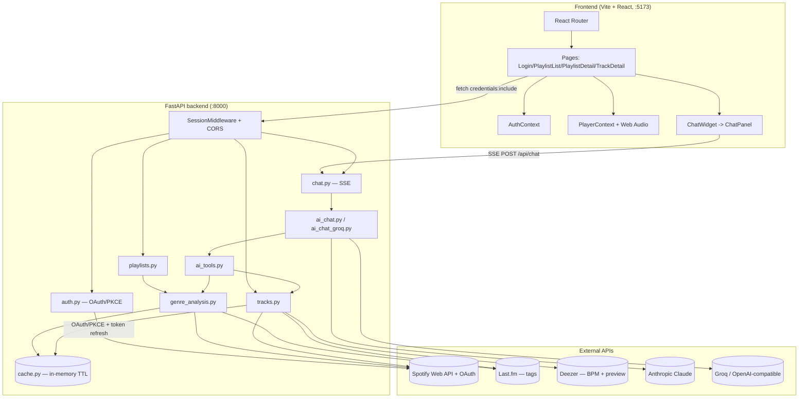
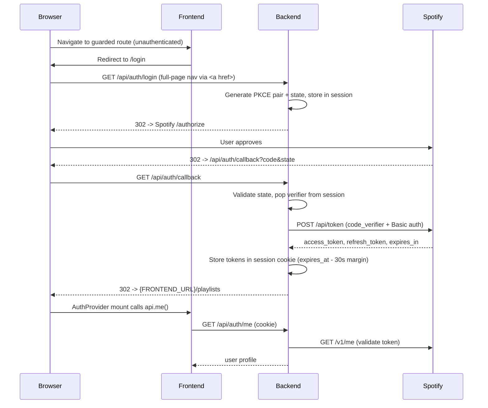
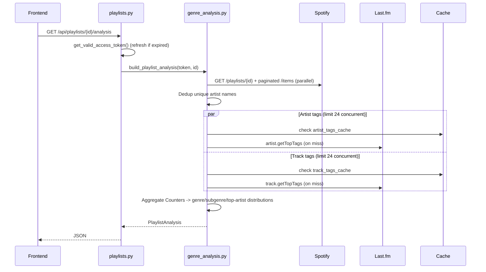
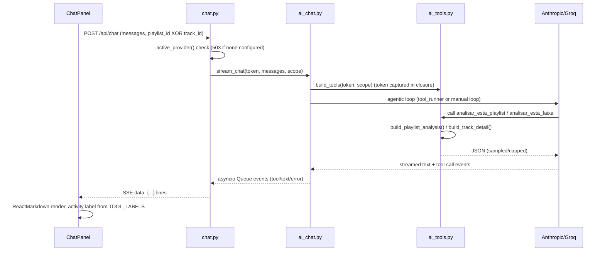

# Codebase Map

> Auto-generated by Cartographer. Last mapped: 2026-09-09T00:00:26Z

> **Nota manual:** este mapa retrata a árvore no commit `1a178a8`. Depois dele
> entraram cinco módulos que ele não descreve — `vector_store.py` (busca
> semântica), `clustering.py` (grupos de clima), `mcp_server.py` +
> `spotify_auth.py` (servidor MCP), `metrics.py` (custo por turno) e `search.py`
> (rota da busca), além de `backend/tests/` e `backend/evals/`. Rode o
> Cartographer de novo para atualizar; até lá, o README é a fonte mais atual.

## System Overview

Playlist Classifier is a single-user, local-first web app that logs a user into Spotify, analyzes the genre/subgenre makeup of their playlists (Spotify no longer exposes genres, so Last.fm tags fill the gap), enriches tracks with Deezer previews/BPM, and offers an optional LLM chat (Claude or Groq) scoped to one playlist or track at a time.



## Directory Structure

```
playlist-classifier/
├── backend/
│   ├── app/
│   │   ├── __init__.py        # empty package marker
│   │   ├── main.py             # FastAPI app, middleware, /api/health
│   │   ├── config.py           # pydantic-settings env config
│   │   ├── auth.py             # Spotify OAuth+PKCE, session token store/refresh
│   │   ├── models.py           # shared Pydantic response models
│   │   ├── cache.py            # in-memory TTLCache instances
│   │   ├── playlists.py        # GET /api/playlists, /analysis
│   │   ├── tracks.py           # GET /api/tracks/{id}, build_track_detail()
│   │   ├── chat.py             # /api/chat/status, POST /api/chat (SSE)
│   │   ├── ai_chat.py          # provider selection + Anthropic adapter
│   │   ├── ai_chat_groq.py     # Groq (OpenAI-compatible) adapter
│   │   ├── ai_tools.py         # neutral tool registry + system prompts
│   │   ├── genre_analysis.py   # Spotify+Last.fm -> PlaylistAnalysis
│   │   ├── spotify_client.py   # Spotify Web API wrapper
│   │   ├── deezer_client.py    # Deezer search/match (BPM, preview)
│   │   └── lastfm_client.py    # Last.fm tag lookups
│   └── requirements.txt
├── frontend/
│   ├── src/
│   │   ├── main.jsx             # entry, BrowserRouter mount
│   │   ├── App.jsx              # route table, Navbar, RequireAuth guard
│   │   ├── api.js                # fetch wrapper / backend API client
│   │   ├── AuthContext.jsx       # session-based auth state
│   │   ├── PlayerContext.jsx     # single <audio> + Web Audio graph
│   │   ├── audioAnalysis.js      # waveform peaks + spectral metrics (no BPM)
│   │   ├── index.css             # design tokens + component-prefixed CSS
│   │   ├── pages/
│   │   │   ├── Login.jsx
│   │   │   ├── PlaylistList.jsx
│   │   │   ├── PlaylistDetail.jsx
│   │   │   └── TrackDetail.jsx
│   │   └── components/
│   │       ├── AnalysisLoader.jsx
│   │       ├── AudioMetrics.jsx
│   │       ├── ChatPanel.jsx
│   │       ├── ChatWidget.jsx
│   │       ├── DistributionBarChart.jsx
│   │       ├── NowPlayingBar.jsx
│   │       ├── TopArtistsChart.jsx
│   │       ├── TrackTable.jsx
│   │       └── Waveform.jsx
│   ├── index.html
│   ├── package.json
│   └── vite.config.js
└── README.md
```

## Module Guide

### Backend: Auth & Session (`backend/app/auth.py`, `config.py`)

**Purpose**: Spotify OAuth 2.0 Authorization Code + PKCE login; server-side session cookie is the only place tokens live (never sent to the browser).
**Entry point**: `auth.py` router, mounted in `main.py`.

| File | Purpose | Tokens |
|------|---------|--------|
| `auth.py` | Login/callback/me/logout routes + `get_valid_access_token()` | 1242 |
| `config.py` | `Settings` (pydantic-settings) + `get_settings()` (lru_cache) | 315 |

**Exports**: `GET /api/auth/login`, `GET /api/auth/callback`, `GET /api/auth/me`, `POST /api/auth/logout`, `get_valid_access_token(request) -> str` (imperative auth check, not a `Depends`).
**Dependencies**: `httpx`, Starlette `SessionMiddleware` (itsdangerous-signed cookie), Spotify accounts/token endpoints.
**Dependents**: `playlists.py`, `tracks.py`, `chat.py` all call `get_valid_access_token()` directly.

**Flow**:
1. `/login` builds PKCE pair (S256) + `state`, stashes both in the session cookie, redirects to Spotify `/authorize`.
2. `/callback` validates `state`, exchanges `code` for tokens (PKCE verifier **and** HTTP Basic client_id:client_secret — "belt and suspenders"), stores `access_token`/`refresh_token`/`expires_at` (with a 30s safety margin) in the session, redirects to `{FRONTEND_URL}/playlists`.
3. `get_valid_access_token()` reuses the token if not expired; otherwise refreshes via the same token endpoint. On refresh failure, clears the session and raises 401.

**Gotchas**: `SESSION_SECRET` defaults to an insecure placeholder if unset; `https_only=False` is hardcoded dev-only; no CSRF beyond `state` comparison; single-process/no DB — explicitly documented as single-user/local-only.

### Backend: Playlists & Tracks (`playlists.py`, `tracks.py`, `genre_analysis.py`)

**Purpose**: Core domain logic — list playlists, analyze genre/subgenre distribution, and produce enriched single-track detail.
**Entry point**: routers mounted in `main.py`.

| File | Purpose | Tokens |
|------|---------|--------|
| `playlists.py` | `GET /api/playlists`, `GET /api/playlists/{id}/analysis` | 534 |
| `tracks.py` | `GET /api/tracks/{id}`, shared `build_track_detail()` | 784 |
| `genre_analysis.py` | `build_playlist_analysis()` — Spotify+Last.fm aggregation | 1269 |
| `models.py` | Pydantic models: `PlaylistSummary`, `TrackGenreInfo`, `TrackDetail`, `GenreCount`, `PlaylistAnalysis` | 390 |

**Exports**: `build_playlist_analysis(token, playlist_id) -> PlaylistAnalysis` and `build_track_detail(token, track_id) -> TrackDetail` — both reused directly by the AI tool layer (`ai_tools.py`), not just the HTTP routes.
**Patterns**: Concurrent fan-out via `asyncio.gather`; Last.fm lookups deduplicated by unique artist name and bounded to 24 concurrent requests (`gather_with_concurrency`, benchmarked in-code: 24 concurrent → 1.08s/60 lookups, zero 429s); `tracks.py` fans Deezer + Last.fm-track + Last.fm-artist out in parallel with `return_exceptions=True` so one failing source degrades to `None`/`[]` instead of failing the request.
**Dependencies**: `spotify_client.py`, `lastfm_client.py`, `deezer_client.py`, `cache.py`.
**Gotchas**: `genre = union of artist tags`, `subgenre = union of genre tags + track-level Last.fm tags`; Spotify returns explicit `null` (not absent keys) for missing fields, so code uses `.get(x) or default`, not `.get(x, default)`. BPM present on ~43% of tracks, preview_url on ~93% (Deezer-sourced, nullable by design).

### Backend: External API Clients (`spotify_client.py`, `deezer_client.py`, `lastfm_client.py`, `cache.py`)

| File | Purpose | Tokens |
|------|---------|--------|
| `spotify_client.py` | Spotify Web API wrapper + `gather_with_concurrency` helper | 501 |
| `deezer_client.py` | Deezer search/match — BPM + preview URL | 1639 |
| `lastfm_client.py` | Last.fm `artist.getTopTags`/`track.getTopTags` | 807 |
| `cache.py` | Three in-memory `cachetools.TTLCache` instances | 203 |

**Spotify** (`api.spotify.com/v1`): `GET /me/playlists` (paginated), `GET /playlists/{id}`, `GET /playlists/{id}/items` (paginated — replaces the removed `/tracks` endpoint; each item's key is `item`, not `track`), `GET /tracks/{id}`, `GET /me`. No batch endpoints (Spotify removed them in 2026) — this is *why* genre data comes from Last.fm instead of Spotify's old `genres` field.
**Deezer** (public, no key): two-pass search (structured `artist:"X" track:"Y"` query, then free-text fallback) + `GET /track/{id}` for BPM. Confidence scoring: `"alta"`/`"aproximada"`/`"nenhuma"` based on title/artist normalization, variant-marker detection (live/remix/acoustic/cover/etc.), and duration diff (max 12s). BPM `0` → `None`. Errors swallowed, return `None`, no rate-limit handling.
**Last.fm**: requires `LASTFM_API_KEY` (no default — app fails to start without it). `NOISE_TAGS` filters out non-genre tags ("seen live", decades). Any HTTP/JSON error → `[]` silently, no retry.
**Cache** (`cache.py`): `artist_tags_cache` (5000 max, 24h TTL), `track_tags_cache` (10000 max, 24h TTL), `deezer_cache` (5000 max, 30min TTL — short because Deezer preview URLs are signed/expiring; caches confirmed misses too). All process-local — restart wipes everything; explicitly documented as unsafe for multi-worker deployment.

**⚠️ Known project constraint** (see `[[spotify-api-ban]]`): the user has previously been rate-limit banned by the Spotify API. Avoid bulk/high-volume direct Spotify calls in any future work here — prefer the existing cache layer or Deezer/Last.fm where the data overlaps.

### Backend: AI Chat (`chat.py`, `ai_chat.py`, `ai_chat_groq.py`, `ai_tools.py`)

**Purpose**: Optional LLM chat scoped to exactly one playlist or one track, streamed to the client over SSE, with tool-use so the model can pull real data.
**Entry point**: `POST /api/chat` in `chat.py`.

| File | Purpose | Tokens |
|------|---------|--------|
| `chat.py` | Request validation (`ChatRequest`, XOR of playlist_id/track_id) + SSE route | 445 |
| `ai_chat.py` | Provider selection + Anthropic adapter (`tool_runner`) + shared SSE queue plumbing | 1288 |
| `ai_chat_groq.py` | Groq (OpenAI-compatible) adapter with a manual agent loop | 1542 |
| `ai_tools.py` | Provider-neutral `Tool` registry + Portuguese system prompts | 1840 |

**Exports**: `GET /api/chat/status` → `{available, provider}`; `POST /api/chat` → `StreamingResponse` (`text/event-stream`); `active_provider()`, `stream_chat()`.
**Patterns**:
- Provider chosen via `CHAT_PROVIDER` env var (`"anthropic"` default or `"groq"`), gated on the matching API key being present — no automatic fallback.
- Both adapters emit an identical event contract (`{"type": "tool"|"text"|"error", ...}`) onto a shared `asyncio.Queue`; `chat.py`'s generator just drains it into `data: {...}\n\n` SSE lines.
- Anthropic path uses the SDK's built-in `client.beta.messages.tool_runner()` agentic loop (model hardcoded: `claude-opus-5`). Groq path hand-rolls tool-call-delta assembly, dedup via a `served` cache keyed by `"{name}:{arguments}"`, parallel tool execution via `asyncio.gather`, and a hard `MAX_ITERATIONS = 4` cap.
- **Security pattern**: the Spotify access token is captured in a closure inside `build_tools()` — never exposed to the model as a callable parameter.
- Exactly one tool exists per scope: `analisar_esta_playlist` (calls `build_playlist_analysis`, samples ≤40 tracks, top 15 genres/subgenres, top 10 artists) or `analisar_esta_faixa` (calls `build_track_detail`). Both cap output size and note sampling in the JSON returned to the model.

**⚠️ Discrepancy vs README**: the README describes an account-wide `visao_geral(limite)`/`listar_playlists()` tool flow that **does not exist** in `ai_tools.py` — only the two single-scope tools above exist, matching `chat.py`'s validator (exactly one of playlist_id/track_id). Treat that part of the README as stale/aspirational.

### Backend: Entry Point (`main.py`)

**Purpose**: FastAPI app construction, middleware wiring, health check.
**Key files**: `main.py` (231 tokens).
**Exports**: `app` (FastAPI instance), `GET /api/health`.
**Dependencies**: `SessionMiddleware` (added before `CORSMiddleware`), single-origin CORS (`allow_credentials=True`, `allow_origins=[settings.frontend_url]`) — required because the session cookie crosses the 5173→8000 origin split.

### Frontend: App Shell & Routing (`main.jsx`, `App.jsx`)

**Purpose**: Vite/React 18 bootstrap, top-level layout, client route table, auth guard.
**Key files**: `main.jsx` (71 tokens), `App.jsx` (693 tokens).
**Exports**: `App` (default), local `Navbar`/`RequireAuth`.

**Client route table** (`App.jsx`):
| Path | Component | Guarded? |
|---|---|---|
| `/login` | `Login` | no |
| `/playlists` | `PlaylistList` | yes |
| `/playlists/:id` | `PlaylistDetail` | yes |
| `/faixa/:id` | `TrackDetail` | yes |
| `*` | redirect → `/playlists` | — |

**Patterns**: `AuthProvider` > `PlayerProvider` > `Navbar`/routes/`NowPlayingBar` — auth and the audio player persist across navigation since the single `<audio>` element must never remount.

### Frontend: State (`AuthContext.jsx`, `PlayerContext.jsx`, `api.js`)

| File | Purpose | Tokens |
|------|---------|--------|
| `api.js` | Fetch wrapper — all backend calls | 382 |
| `AuthContext.jsx` | Session-based auth state (`user`, `loading`, `refresh`, `logout`) | 207 |
| `PlayerContext.jsx` | Single `<audio>` + Web Audio analyser graph | 971 |

**api.js — backend calls**:
| Function | Method | Path |
|---|---|---|
| `me()` | GET | `/api/auth/me` |
| `logout()` | POST | `/api/auth/logout` |
| `loginUrl()` | (URL string, full-page nav) | `/api/auth/login` |
| `listPlaylists()` | GET | `/api/playlists` |
| `getPlaylistAnalysis(id)` | GET | `/api/playlists/{id}/analysis` |
| `getTrack(id)` | GET | `/api/tracks/{id}` |
| `chatStatus()` | GET | `/api/chat/status` |
| `chatStream(messages, {playlistId, trackId})` | POST (raw stream) | `/api/chat` |

All requests use `credentials: "include"`; auth is entirely server-side (no localStorage tokens) — `AuthContext` just calls `api.me()` on mount to hydrate `user` from the session cookie.

**PlayerContext**: renders the app's *one* `<audio>` element (outside `<Routes>` so navigation never interrupts playback). Web Audio graph (`AudioContext` → `AnalyserNode` → `MediaElementSource`) is built lazily on first `play()` (autoplay-policy requirement) and exposed via `analyserRef` so `Waveform`/`NowPlayingBar` can read live spectrum data. `crossOrigin="anonymous"` is required on `<audio>` for the analyser to read Deezer preview PCM data without CORS taint.

### Frontend: Audio Analysis (`audioAnalysis.js`)

**Purpose**: Pure client-side signal processing — waveform peaks + spectral metrics from a decoded preview buffer (900-bucket min/max peaks, RMS/peak/crest dB, band-energy split via hand-written FFT, spectral centroid).
**Key files**: `audioAnalysis.js` (2009 tokens).
**Exports**: `calcularPicos`, `calcularMetricas`, `analisarPrevia(url)`.
**Gotcha (documented in-code)**: a BPM-via-autocorrelation detector was built and deliberately removed after validation against Deezer's own BPM values showed only 60% precision — this is why BPM is shown only from Deezer metadata, never computed client-side.

### Frontend: Pages (`pages/`)

| File | Purpose | Tokens |
|------|---------|--------|
| `Login.jsx` | OAuth entry — full-page `<a href={api.loginUrl()}>` | 278 |
| `PlaylistList.jsx` | Playlist grid + client-side name filter | 720 |
| `PlaylistDetail.jsx` | Genre/subgenre charts, top artists, track table, chat | 913 |
| `TrackDetail.jsx` | Track metadata, waveform, audio metrics, chat | 1319 |

**Patterns**: `PlaylistDetail`/`TrackDetail` share a dual-`useEffect` pattern — refetch on `:id` change (resetting state first to avoid stale flashes), plus a separate mount-once `chatStatus()` check that silently disables `ChatWidget` on failure (chat treated as non-critical).

### Frontend: Components (`components/`)

| File | Purpose | Tokens |
|------|---------|--------|
| `AnalysisLoader.jsx` | Fake-progress loader (asymptotic curve, never reaches 100%) | 636 |
| `AudioMetrics.jsx` | Static whole-track waveform (Canvas) + metrics panel | 1863 |
| `ChatPanel.jsx` | Chat logic — SSE stream reader, markdown rendering | 1249 |
| `ChatWidget.jsx` | FAB + drawer chrome wrapping `ChatPanel` (lazy-mounted) | 1070 |
| `DistributionBarChart.jsx` | Generic horizontal bar chart (Recharts) w/ "outros" bucket | 944 |
| `NowPlayingBar.jsx` | Fixed footer player bar | 945 |
| `TopArtistsChart.jsx` | Preset wrapper over `DistributionBarChart` | 77 |
| `TrackTable.jsx` | Searchable playlist track table | 689 |
| `Waveform.jsx` | Live oscilloscope + spectrum (Canvas, rAF loop, reads `analyserRef`) | 1429 |

**Exports**: all default-export React components.
**PlayerContext consumers**: `AudioMetrics`, `NowPlayingBar`, `Waveform`.
**ChatPanel vs ChatWidget**: `ChatPanel` is the reusable chat implementation (message list, SSE streaming, markdown); `ChatWidget` is pure UI chrome (FAB + slide-in drawer, focus management, `inert` a11y) that lazily mounts one `ChatPanel` on first open. Used via `ChatWidget` in both `PlaylistDetail` (scope `"playlist"`) and `TrackDetail` (scope `"track"`).
**Waveform vs AudioMetrics**: `Waveform` is a live, continuously-animating `requestAnimationFrame` visualization of the currently-playing `AnalyserNode`; `AudioMetrics` is a static, precomputed whole-track overview drawn once from `audioAnalysis.js` output and redrawn only on prop/data change.
**Charting**: Recharts is the only charting library (`DistributionBarChart`, wrapped by `TopArtistsChart`); `Waveform`/`AudioMetrics` are hand-rolled Canvas 2D — no other lib.

## Data Flow

### OAuth login



### Playlist genre analysis



### AI chat (SSE, tool-use)



## Conventions

- **Backend**: async FastAPI routers per resource, imperative auth check (`get_valid_access_token(request)`) at the top of each protected handler rather than a `Depends()`-based dependency. Pydantic models centralized in `models.py`. Upstream errors (`httpx.HTTPStatusError`) are caught at the route boundary and mapped to 404/502, or JSON-stringified for AI tools so the agent loop stays alive.
- **Frontend**: plain `fetch` (no axios/query lib), Context API for cross-cutting state (no Redux/Zustand), plain CSS with a design-token system (no Tailwind/CSS-in-JS). Portuguese (`pt-BR`) is the UI/copy language throughout, including code comments and variable names in some files (`picos`, `metricas`, `estaAqui`, etc.).
- **Naming**: CSS classes are component/feature-prefixed (`.chat-*`, `.nowplaying-*`, `.player-*`) rather than utility-atomic; React components are default-exported, one per file.
- **Concurrency**: backend consistently bounds fan-out with either `asyncio.gather` (small, fixed sets) or a semaphore-based `gather_with_concurrency` helper (unbounded per-item sets like Last.fm lookups).

## Gotchas

- **Spotify API ban risk** (see `[[spotify-api-ban]]` in project memory): the user has been rate-limited/banned before. No batch Spotify endpoints exist post-2026 migration anyway, so genre data intentionally comes from Last.fm and BPM/preview from Deezer — avoid introducing new bulk Spotify calls.
- `SESSION_SECRET` and `https_only=False` are dev-only defaults in `config.py`/`main.py` — must be hardened before any real deployment.
- All caching (`cache.py`) is single-process in-memory — restarting the backend, or running multiple uvicorn workers, breaks cache consistency.
- README describes a `visao_geral`/`listar_playlists` multi-playlist AI tool flow that **does not exist** in `ai_tools.py` — only single-scope tools are implemented. Don't trust that section of the README.
- `audioAnalysis.js` deliberately has no BPM detector (removed after failed validation) — BPM always comes from Deezer metadata (`track.bpm`), including a `"aproximada"` (approximate) match-confidence flag that both `TrackDetail.jsx` and `deezer_client.py` propagate end-to-end.
- Dev CORS/session setup requires using `127.0.0.1` consistently (not `localhost`) on both frontend and backend, due to `SameSite=Lax` cookie + single-origin CORS.
- `PlayerContext`'s single `<audio>` element must never be duplicated — `createMediaElementSource` can only be called once per element; this is why the player lives above `<Routes>` in `App.jsx`.

## Navigation Guide

**To add a new API endpoint**: create/extend a router file in `backend/app/`, add Pydantic models to `models.py` if needed, mount the router in `main.py`, add a corresponding call in `frontend/src/api.js`.

**To add a new page**: create a component in `frontend/src/pages/`, add its route to the table in `App.jsx` (wrap in `<RequireAuth>` if it needs auth), add a nav link if appropriate.

**To add a new component**: create in `frontend/src/components/`, follow the component-prefixed CSS class convention in `index.css`, wire up `usePlayer`/`useAuth` only if it truly needs that context.

**To modify auth/OAuth**: `backend/app/auth.py` (server flow) + `frontend/src/AuthContext.jsx`/`Login.jsx` (client flow) + `config.py` for new env vars.

**To change genre/subgenre logic**: `backend/app/genre_analysis.py` (aggregation) and `lastfm_client.py` (tag source/filtering, `NOISE_TAGS`).

**To change Deezer matching (BPM/preview)**: `backend/app/deezer_client.py` — confidence scoring, variant detection, normalization all live there; TTL in `cache.py`.

**To modify AI chat**: `backend/app/ai_tools.py` (tool definitions/prompts, shared by both providers) + `ai_chat.py` (Anthropic) or `ai_chat_groq.py` (Groq) for provider-specific streaming/tool-loop logic + `chat.py` for the HTTP/SSE contract + `frontend/src/components/ChatPanel.jsx` (stream parsing) and `ChatWidget.jsx` (UI chrome).

**To modify audio playback/visualization**: `frontend/src/PlayerContext.jsx` (audio element + Web Audio graph) + `Waveform.jsx` (live viz) + `AudioMetrics.jsx` (static overview) + `audioAnalysis.js` (metrics computation).
